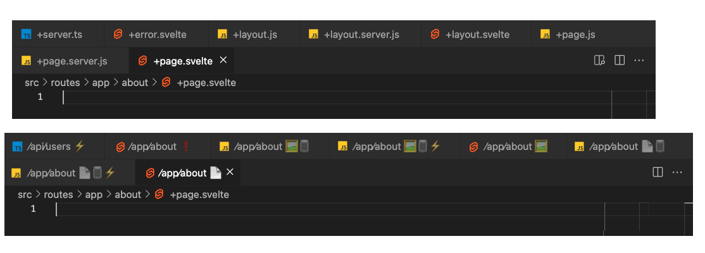

# Better Sveltekit Tab Labels

----

UPDATE: 09/07/2024

VSCode now supports [custom tab labels](https://code.visualstudio.com/updates/v1_91)!

We no longer need to put up with `+page.svelte`, `+server.ts` all over our editor tabs anymore.

For example, we can define config in our `settings.json` like below:

```json5
{
  // ...
  "workbench.editor.customLabels.patterns": {
    // Page
    "**/routes/**/*/+page.svelte": "${dirname} - Page",
    "**/routes/+page.svelte": "(root) - Page",
    // Layout
    "**/routes/**/*/+layout.svelte": "${dirname} - Layout",
    "**/routes/+layout.svelte": "(root) - Layout",
    // Page Data
    "**/routes/**/*/+page.[tj]s": "${dirname} - Page Data",
    "**/routes/+page.[tj]s": "(root) - Page Data",
    // Layout Data
    "**/routes/**/*/+layout.[tj]s": "${dirname} - Layout Data",
    "**/routes/+layout.[tj]s": "(root) - Layout Data",
    // Page Server Data
    "**/routes/**/*/+page.server.[tj]s": "${dirname} - Page Server Data",
    "**/routes/+page.server.[tj]s": "(root) - Page Server Data",
    // Page Layout Data
    "**/routes/**/*/+layout.server.[tj]s": "${dirname} - Layout Server Data",
    "**/routes/+layout.server.[tj]s": "(root) - Layout Server Data",
    // Error Page
    "**/routes/**/*/+error.svelte": "${dirname} - Error Page",
    "**/routes/+error.svelte": "(root) - Error Page",
    // Server Endpoint
    "**/routes/**/*/+server.[tj]s": "${dirname} - Server Endpoint"
  }
}
```

And get a result like:


More info on customization [here](https://code.visualstudio.com/docs/getstarted/userinterface#_customize-tab-labels)

-------

2023/02/28


__Cannot be completed__ unless the VS Code extensions API adds support for changing/overriding tab labels.

(it would also be helpful if the tabs API contains file information like the URI of the file)

> For Reference:
>
> VSCode Github issue: [Provide API to access and change editor tab labels](https://github.com/microsoft/vscode/issues/41909)
>
> VSCode Tab documentation: [Tabs Reference](https://code.visualstudio.com/api/references/vscode-api#Tab)
> (it does not specify that the "label" is readonly, but it appears to be readonly in code-level + no relevant functions to call to mutate this value)

## Description

A VS Code extension for SvelteKit.

Aims to change the editor tab label in your VS Code editor
if the file is a route in your SvelteKit application.

> What it can potentially look like. (?)
> 

## Features

Extension will activate if a `svelte.config.js` file exists in the root directory,
followed by `src/routes/` which contains SvelteKit routes.

By default, the extension changes route files to the following format:


| Type                   | Filepath                                | New Label        |
| ---------------------- | --------------------------------------- | ---------------- |
| Page                   | `/app/about/+page.svelte`               | /app/about 📄     |
| Page Module            | `/app/about/+page.js` (or `.ts`)        | /app/about 📄 🫙   |
| Page Module (server)   | `/app/about/+page.server.js` (or `.ts`) | /app/about 📄 🫙 ⚡ |
| Error                  | `/app/about/+error.svelte`              | /app/about ❗     |
| Layout                 | `/app/about/+layout.svelte`             | /app/about 🖼️     |
| Layout Module          | `/app/about/+layout.js`                 | /app/about 🖼️ 🫙   |
| Layout Module (server) | `/app/about/+layout.server.js`          | /app/about 🖼️ 🫙 ⚡ |
| Server                 | `/api/users/+server.js` (or `.ts`       | /api/users ⚡     |

Emoji characters worth considering:
* Data 💽 💾 💿 📀 🏗 ⚙️ ⚙
* Error ❗ ❌ 🚫 🆘 🛟
* Server 📶 📡 ⚡ 💻 🖥
* Layout 🖼️ 🌄 🌋 🗻 🏔 🏞 🏜
* Module 🥛 🍾 🫙 🧑‍💻

Template formats worth considering:
* About Page Data
* /app/about Page Data
* /app/about 📄 📀
*  📄 📀 /app/about

## Extension Settings

This extension contributes the following settings:

* `betterSvelteKitTabLabels.tabLabelTemplate`: String that is used to format the new tab label. Defaults to `"{routepath}{page}{layout}{error}{module}{server}"`.
* `better-sveltekit-tab-labels.routeTypeString.*`: String (can contain emojis) for a type of route file. It will populate the `tabLabelTemplate` if the file is applicable (otherwise populates as an empty string).
  * `page`: Defaults to " 📄"
  * `module`: Defaults to " 🫙"
  * `server`: Defaults to " ⚡"
  * `error`: Defaults to " ❗"
  * `layout`: Defaults to " 🖼️"

## Release Notes

TODO: Release something. Possibly. Eventually.


> TODO: See [Extension Guidelines](https://code.visualstudio.com/api/references/extension-guidelines)
